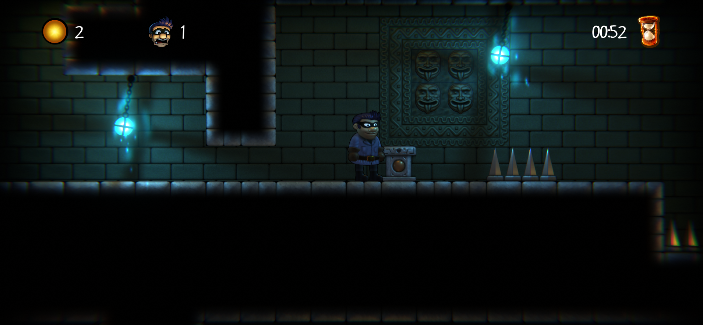

# Platformer Game01



Welcome to the  Platformer Game! This exciting platform game provides a thrilling adventure full of jumps, obstacles, and challenges. Get ready to explore a vibrant world, defeat enemies, and conquer tricky levels!

## Table of Contents

- [Controls](#controls)
- [Installation](#installation)
- [Gameplay](#gameplay)
- [Screenshots](#screenshots)
- [Contributing](#contributing)
- [License](#license)

## Controls

- **Arrow Keys or WASD:** Move your character left, right, or crouch.
- **Spacebar:** Jump or double jump.

## Installation

1. Clone the repository:

   ```bash
   git clone https://github.com/your-username/awesome-platformer-game.git

## Screenshots


**


*Caption for Screenshot 2*

